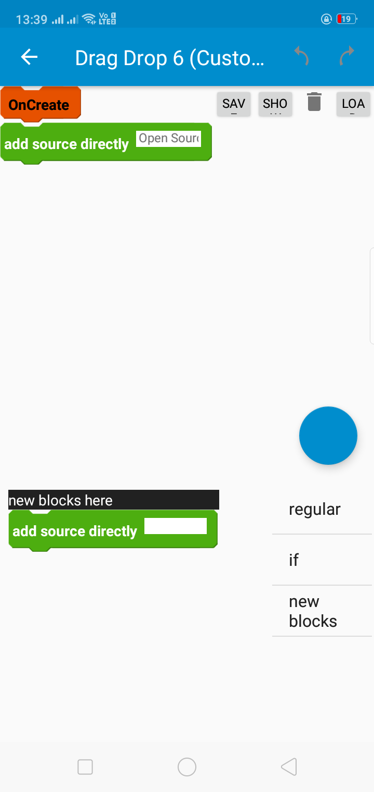
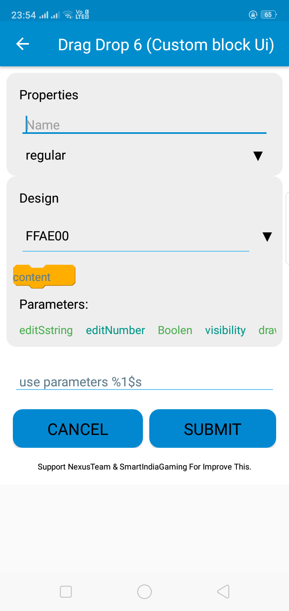

# 🚀 Drag & Drop Block-Based Programming System  

A **powerful open-source** block-based programming system that enables users to generate source code visually using an intuitive block-based UI.  

---

## 📸 Screenshots  

### **Main UI**  
  

### **Custom Block Creation**  
  

---

## 🌟 Key Features  

✔ **Drag & Drop Blocks** – Create logic visually without writing code.  
✔ **Custom Block Creation** – Design and reuse personalized blocks.  
✔ **Dynamic Code Generation** – Convert blocks into real, executable source code.  
✔ **Save & Load System** – Store and retrieve projects effortlessly.  
✔ **Variable Support** – Use variables dynamically in blocks.  
✔ **List Operations** – Perform advanced operations like set, add, and remove.  
✔ **Event-Based System** – Trigger actions on events like `OnCreate`.  
✔ **Boolean, String & Number Blocks** – Support multiple data types.  
✔ **Optimized Performance** – Lightweight and fast execution.  
✔ **Modern UI/UX** – Designed for smooth usability and interaction.  

---

## 🔥 Feature Overview  

| Feature | Status |  
|----------------------------|--------|  
| **Drag & Drop Block UI** | ✅ |  
| **OnCreate Event** | ✅ |  
| **Text Input Block** | ✅ |  
| **Add Values in Blocks** | ✅ |  
| **List Operations (Set, Add, Remove)** | ✅ |  
| **If-Else Condition Block** | ⬜ |  
| **Save & Load Options** | ✅ |  
| **Floating Action Button (FAB)** | ✅ |  
| **Block Condition Checking** | ✅ |  
| **Clear List Block** | ✅ |  
| **Get Item from List** | ✅ |  
| **Custom Block Creation** | ✅ |  
| **Variable Support** | ⬜ |  
| **Number Input Block** | ✅ |  
| **String Input Block** | ✅ |  
| **Boolean Input Block** | ✅ |  
| **Custom Block Code Support** | ✅ |  
| **Number Block** | ⬜ |  
| **Boolean Block** | ⬜ |  
| **String Block** | ⬜ |  
| **Save & Load Logic** | ✅ |  
| **Undo & Redo Actions** | 🔄 Coming Soon |  
| **Block Duplication** | 🔄 Coming Soon |  

---

## 🛠️ How It Works  

1. **Drag & Drop Blocks** – Build logic visually using an interactive UI.  
2. **Create Custom Blocks** – Design, save, and reuse your own blocks.  
3. **Save & Load Projects** – Keep your work saved and reload anytime.  
4. **Generate Source Code** – Convert block-based logic into real programming code.  
5. **Edit & Debug Easily** – Modify block connections and test your logic.  

---

## 📥 Installation  

To set up the project, follow these steps:  

```bash
# Clone this repository
git clone https://github.com/NexusTeamOfficial/Blocks-System.git

# Navigate into the project directory
cd Blocks-System
```

---

## 🎯 Upcoming Features (Roadmap)  

🚀 **Planned Enhancements:**  

- [ ] Implement **If-Else Condition Block**  
- [ ] Add **Variable Support**  
- [ ] Improve **Block Editing UI**  
- [ ] Enhance **Code Generation Engine**  
- [ ] Introduce **Undo & Redo Actions**  
- [ ] Implement **Block Duplication Feature**  
- [ ] Optimize **Performance & Rendering Speed**  
- [ ] Expand **Language Support (C++, Python, JavaScript, etc.)**  

---

## 🤝 Contributing  

We welcome contributions! 🎉  

✅ **How to contribute:**  
1. Fork the repository.  
2. Create a new branch (`feature-name`).  
3. Commit your changes.  
4. Open a **Pull Request** with a description of your improvements.  

---

## 🛡️ Security  

🔒 Our block-based programming system ensures **data integrity** and prevents **unauthorized modifications**.  
- Uses **secure project storage** mechanisms.  
- Prevents **accidental loss of blocks**.  

---

## 🏆 Why Choose This Project?  

✔ **Open-Source & Free** – No restrictions, modify as you wish.  
✔ **Easy to Use** – Built with a beginner-friendly interface.  
✔ **High Performance** – Optimized for speed and efficiency.  
✔ **Expandable** – Add new blocks and logic with ease.  
✔ **Active Development** – Constant improvements and new features.  

---

## 📄 License  

This project is open-source and available under the [MIT License](LICENSE).  

---

## 📂 JSON Example  

View an example block structure in JSON format: [View JSON](block.json).  
