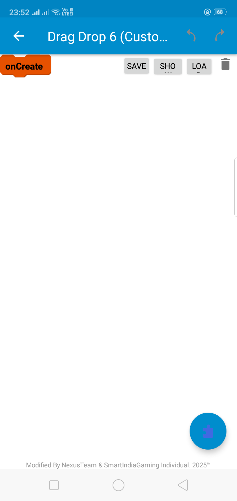

# 🚀 **Drag & Drop Block-Based Programming System**  
### **A Powerful, Open-Source Visual Programming Framework**  

  

**Version:** `v1.0.1` | **License:** `MIT` | **Developed By:** `NexusTeam & SmartIndiaGaming`  

---

## 🔷 **Introduction**  

The **Drag & Drop Block-Based Programming System** is an **open-source, highly optimized, and professional-grade** block-based programming environment. It allows users to build logical workflows **visually** and instantly generate **real, executable source code** from blocks.  

**🔹 Java 7-8 Compatible** – Built with broad compatibility to support older and newer systems.  

> 🏆 **A groundbreaking achievement by a single student (Grade 1-10) without formal training—demonstrating that innovation has no boundaries!**  

---

## 🌟 **Why Choose This Project?**  

✔ **Real-World Code Generation** – Converts blocks into real, executable source code.  
✔ **Java 7-8 Support** – Ensures wide compatibility across systems.  
✔ **Fully Open-Source** – Modify, enhance, and extend freely.  
✔ **Custom Block Creation** – Define and reuse your own custom logic blocks.  
✔ **Optimized Performance** – Designed for **speed, efficiency, and low resource consumption**.  
✔ **Drag & Drop Interface** – Simple, **intuitive UI** for easy workflow creation.  

This **isn't just another toy block system**—it's a **serious development framework** designed for **real programming applications**.  

---

## 📸 **Screenshots & Demo**  

### **🚀 Interactive Block UI**  
  

### **🔹 Custom Block Creation**  
  

More demos coming soon! 🚀  

---

## 🏗 **How It Works**  

1️⃣ **Drag & Drop Blocks** – Build your logic visually.  
2️⃣ **Create Custom Blocks** – Save and reuse custom logic elements.  
3️⃣ **Save & Load Projects** – Securely store your work for future editing.  
4️⃣ **Generate Source Code** – Convert block-based workflows into real programming languages.  
5️⃣ **Edit & Debug Easily** – Modify block connections and validate logic dynamically.  

---

## 🔥 **Feature Overview**  

| Feature | Status |  
|----------------------------|--------|  
| **Drag & Drop Logic Builder** | ✅ |  
| **Custom Block Support** | ✅ |  
| **Project Save & Load** | ✅ |  
| **Real-Time Code Generation** | ✅ |  
| **Performance-Optimized Rendering** | ✅ |  
| **Multi-Language Code Export** | ⬜ Coming Soon |  
| **Undo/Redo Actions** | 🔄 Planned |  
| **Advanced Variable System** | 🔄 Planned |  
| **Nested Block Structures** | 🔄 Planned |  
| **API & External Libraries Integration** | 🔄 Planned |  

---

## 🎯 **Roadmap & Future Updates**  

🔹 **Version 1.1** – Undo & Redo Functionality  
🔹 **Version 1.2** – Advanced Variable System  
🔹 **Version 1.3** – Nested Blocks Support  
🔹 **Version 1.4** – Code Export for Python, C++, JavaScript  

🚀 **We are actively improving!** You can contribute or request features.  

---

## 🛡️ **Security & Performance**  

🔒 **Secure Data Handling** – Stored with **integrity** and encryption techniques.  
⚡ **Optimized Execution** – Designed for **fast processing** with minimal overhead.  
🚀 **Scalability & Expandability** – Engineered for **long-term extensibility**.  

---

## 📥 **Installation Guide**  

```bash
# Clone the repository
git clone https://github.com/NexusTeamOfficial/Blocks-System.git

# Navigate into the project directory
cd Blocks-System
```

> 💡 **Want to contribute?** Fork the repository and submit a pull request (PR).  

---

## 🤝 **Contributors & Development**  

### **🛠 Made by NexusTeam & SmartIndiaGaming**  
This **entire development model** was created **from scratch** by a **single student** without high-class training. It stands as **proof that expertise and dedication can build enterprise-level software, regardless of background**.  

👨‍💻 **Who Can Contribute?**  
✅ Java & Android Developers  
✅ UI/UX Designers  
✅ Open-Source Enthusiasts  

### **How to Contribute?**  
1️⃣ **Fork the Repository** – Clone and explore the codebase.  
2️⃣ **Create a New Branch** – Use a meaningful branch name (e.g., `feature-custom-blocks`).  
3️⃣ **Commit Your Changes** – Follow best coding practices.  
4️⃣ **Submit a Pull Request** – Contribute and get your code merged!  

---

## 🎯 **Why This Project Stands Out?**  

✔ **100% Open-Source** – Free for everyone, no restrictions.  
✔ **Designed for Beginners & Professionals** – Intuitive yet powerful.  
✔ **Real Coding, Not Just Visualization** – Generates actual source code.  
✔ **Performance & Security Optimized** – Built for production-ready applications.  
✔ **Modular & Scalable** – Easily expandable for future features.  

> **🚀 Not just a block editor—it's a complete development system.**  

---

## 📜 **License**  

This project is **open-source** and licensed under the **MIT License**.  

---
## 📂 JSON Example  

View an example block structure in JSON format: [View JSON](block.json).  


---

## 📢 **Join the Developer Community**  

💬 **Discuss, contribute, and improve!**  
✅ **Report Issues & Bugs** – [GitHub Issues](https://github.com/NexusTeamOfficial/Blocks-System/issues)  
✅ **Request Features** – Suggest and help implement new features.  

---

## **🔹 Final Thoughts: A Developer's Essential Tool**  

> **💡 Real Coding. Real Development. No Gimmicks.**  

This is not just another **block-based tool**—it’s a **professional programming framework** that supports **real-world development**. Whether you’re a **beginner learning programming** or an **experienced developer**, this project is designed to **evolve with your skills**.  

🚀 **Now is the time to build the future of programming—together!**  

---

## 🌍 **Support & Share**  

💖 **Like this project?** Give it a ⭐ on GitHub!  
📢 **Share it!** Encourage fellow developers, students, and enthusiasts.  

🔗 [**GitHub Repository**](https://github.com/NexusTeamOfficial/Blocks-System)  

---

## 🔥 **End Note**  

This **block-based programming system** is not just a side project—it is a **vision for the future of development**. A tool **engineered for efficiency**, supporting **Java 7-8**, built with **high performance**, and structured for **real-world applications**.  

👨‍💻 **Built by one student, used by many, and improved by the community.**  

🚀 **Let's shape the future of programming—one block at a time!**  
